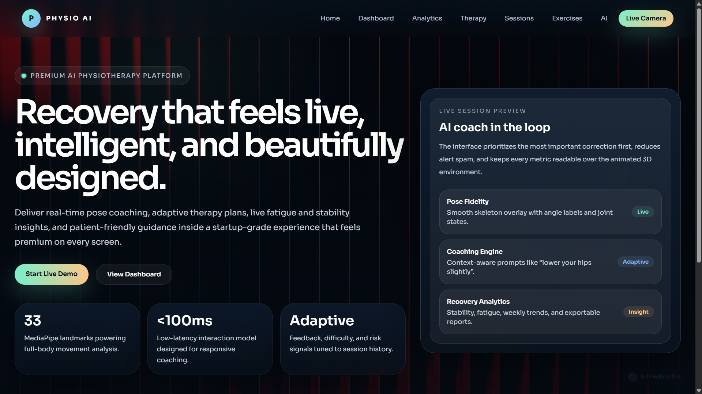
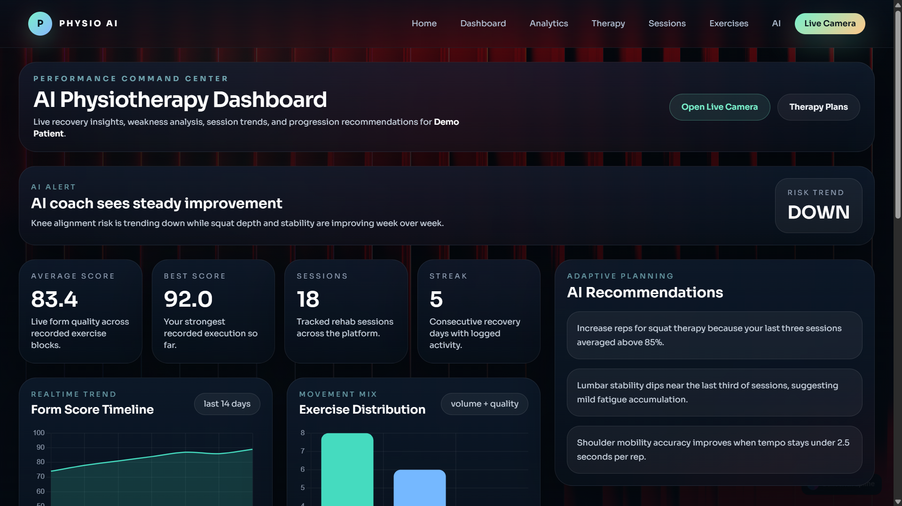
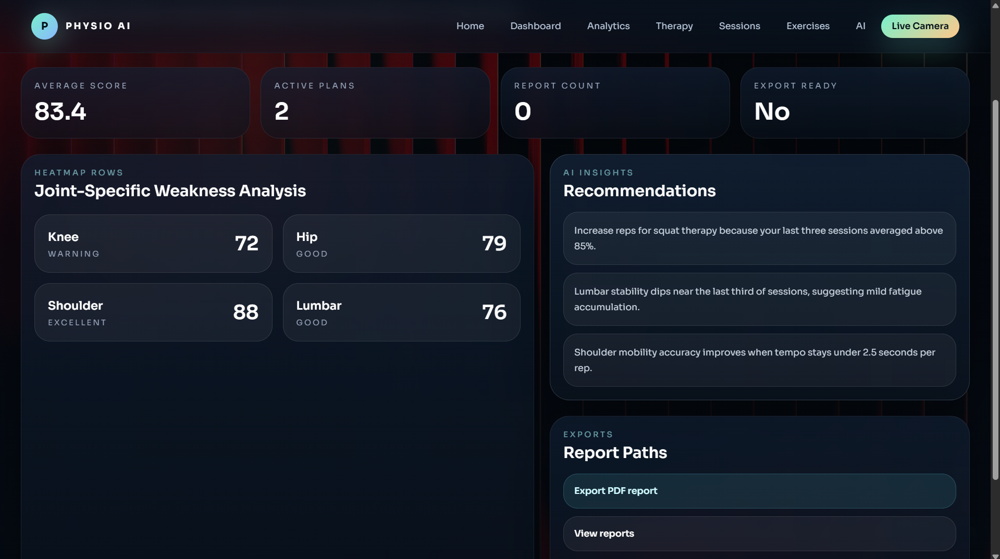
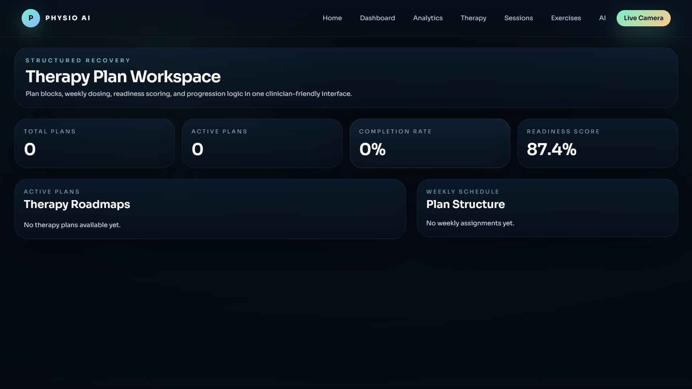
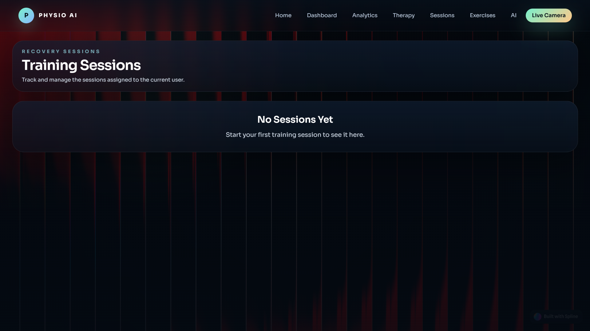
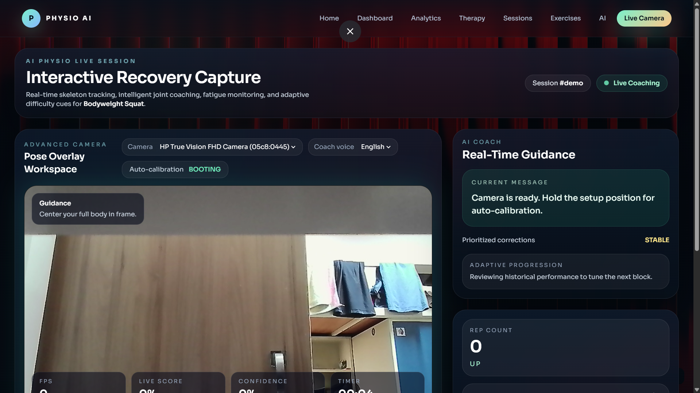

# Physio AI - Django Project

A comprehensive Django project for physiotherapy AI with pose detection and exercise tracking.

## Application Screenshots


<div align="center">
  <br><b>Landing page</b><br><br>
  <br><b>Dashboard</b><br><br>
  <br><b>Analytics</b><br><br>
  <br><b>Therapy Plan</b><br><br>
  <br><b>Training sessions</b><br><br>
  <br><b>Live posture tracking</b>
</div>


## Project Structure

```
physio_ai/
├── physio_ai/              # Main project folder
│   ├── __init__.py         # Makes it a Python package
│   ├── settings.py         # Django configuration (database, apps, middleware)
│   ├── urls.py             # Main URL routing
│   ├── wsgi.py             # WSGI application for deployment
│   └── asgi.py             # ASGI application for async support
│
├── users/                  # User management app
│   ├── models.py           # UserProfile model
│   ├── views.py            # User views
│   ├── urls.py             # User URLs
│   ├── admin.py            # Admin customization
│   └── apps.py             # App configuration
│
├── exercises/              # Exercise library app
│   ├── models.py           # Exercise model
│   ├── views.py            # Exercise views
│   ├── urls.py             # Exercise URLs
│   ├── admin.py            # Admin customization
│   └── apps.py             # App configuration
│
├── sessions/               # Exercise session app
│   ├── models.py           # Session and SessionExercise models
│   ├── views.py            # Session views
│   ├── urls.py             # Session URLs
│   ├── admin.py            # Admin customization
│   └── apps.py             # App configuration
│
├── ai_engine/              # AI analysis app
│   ├── models.py           # AIModel, PoseAnalysis, AIFeedback models
│   ├── views.py            # AI views
│   ├── urls.py             # AI URLs
│   ├── admin.py            # Admin customization
│   └── apps.py             # App configuration
│
├── analytics/              # Analytics and reporting app
│   ├── models.py           # UserProgress, DailyMetrics, ExerciseStatistics, Report models
│   ├── views.py            # Analytics views
│   ├── urls.py             # Analytics URLs
│   ├── admin.py            # Admin customization
│   └── apps.py             # App configuration
│
├── manage.py               # Django management script
├── requirements.txt        # Python dependencies
└── README.md              # This file
```

## App Descriptions

### **users/** - User Management
Handles user accounts and profiles.
- **UserProfile**: Extended user information (age, fitness level, injury history)
- Tracks user fitness data and preferences

### **exercises/** - Exercise Library
Manages available exercises.
- **Exercise**: Exercise templates with difficulty, duration, muscle groups, instructions
- Filterable by difficulty level
- Includes video/image URLs for guidance

### **sessions/** - Exercise Sessions
Tracks user exercise sessions.
- **Session**: Represents a complete session with multiple exercises
- **SessionExercise**: Tracks individual exercises within a session, including form scores and completion status
- Monitors progress and completion rates

### **ai_engine/** - AI Pose Detection & Feedback
Processes AI analysis and generates feedback.
- **AIModel**: Different AI models for pose detection
- **PoseAnalysis**: Frame-by-frame analysis results with form scores
- **AIFeedback**: Generated recommendations based on user performance

### **analytics/** - Progress Tracking & Reports
Aggregates and reports user data.
- **UserProgress**: Overall progress metrics (streaks, total sessions)
- **DailyMetrics**: Daily aggregated statistics
- **ExerciseStatistics**: Exercise popularity and performance data
- **Report**: Weekly/monthly progress reports

## Installation & Setup

### 1. Create Virtual Environment
```bash
python -m venv venv
```

### 2. Activate Virtual Environment
**Windows:**
```bash
venv\Scripts\activate
```

**macOS/Linux:**
```bash
source venv/bin/activate
```

### 3. Install Dependencies
```bash
pip install -r requirements.txt
```

### 4. Apply Migrations
```bash
python manage.py makemigrations
python manage.py migrate
```

### 5. Create Admin Account
```bash
python manage.py createsuperuser
```
Follow the prompts to create your admin account.

### 6. Run Development Server
```bash
python manage.py runserver
```

The server will start at `http://localhost:8000/`

## Accessing the Application

- **Admin Panel**: http://localhost:8000/admin/
  - Login with the superuser account created in step 5
  - Manage users, exercises, sessions, and analytics

- **App URLs**:
  - Users: http://localhost:8000/users/
  - Exercises: http://localhost:8000/exercises/
  - Sessions: http://localhost:8000/sessions/
  - AI Engine: http://localhost:8000/ai/
  - Analytics: http://localhost:8000/analytics/

## Key Files Explained

### `settings.py`
**What it does**: Central configuration file for the entire Django project.

**Key settings**:
- `DEBUG = True`: Shows detailed error messages (disable in production)
- `INSTALLED_APPS`: List of all active Django apps
- `DATABASES`: SQLite database configuration
- `SECRET_KEY`: Security token (change in production)
- `MIDDLEWARE`: Processing layers for requests/responses
- `TEMPLATES`: Template engine configuration

### `urls.py`
**What it does**: Maps URL paths to views and apps.

**How it works**: When a user visits `/exercises/`, this file routes it to the exercises app.

### `manage.py`
**What it does**: Command-line interface for Django management tasks.

**Common commands**:
- `python manage.py runserver` - Start development server
- `python manage.py makemigrations` - Create database changes
- `python manage.py migrate` - Apply database changes
- `python manage.py createsuperuser` - Create admin account
- `python manage.py shell` - Python console with Django context

### App `models.py`
**What it does**: Defines the database structure (like blueprints for tables).

**Example**: `Exercise` model creates a table for storing exercise data with fields like name, difficulty, duration.

### App `views.py`
**What it does**: Contains logic to handle requests and return responses.

**Example**: `ExerciseListView` fetches exercises and displays them in HTML.

### App `urls.py`
**What it does**: Routes URLs specific to that app.

**Example**: Maps `/exercises/1/` to `ExerciseDetailView` to show exercise #1.

### App `admin.py`
**What it does**: Customizes the admin panel for managing app data.

**Example**: `ExerciseAdmin` adds search, filtering, and display customization in admin.

## Common Commands

```bash
# Start development server
python manage.py runserver

# Create a new app
python manage.py startapp app_name

# Create database changes
python manage.py makemigrations

# Apply database changes
python manage.py migrate

# Create admin user
python manage.py createsuperuser

# Open Python shell with Django context
python manage.py shell

# Run tests (if created)
python manage.py test

# Collect static files (for production)
python manage.py collectstatic
```

## Database Models Relationships

```
User (Django built-in)
  ├── UserProfile (1:1)
  ├── Sessions (1:Many)
  │   ├── SessionExercise (1:Many)
  │   │   ├── Exercise (Many:1)
  │   │   └── PoseAnalysis (1:Many)
  │   │       └── AIModel (Many:1)
  │   │   └── AIFeedback (1:1)
  ├── UserProgress (1:1)
  ├── DailyMetrics (1:Many)
  └── Reports (1:Many)
```

## Next Steps

1. **Create templates** in `app_name/templates/` folders
2. **Add static files** (CSS, JS, images) in `static/` folder
3. **Create forms** using Django Forms for user input
4. **Add tests** for reliability
5. **Deploy** to production (set DEBUG=False, use environment variables)

## Production Considerations

Before deploying:
1. Change `SECRET_KEY` in settings.py
2. Set `DEBUG = False`
3. Update `ALLOWED_HOSTS` with your domain
4. Use a production database (PostgreSQL recommended)
5. Set up CSRF and CORS properly
6. Collect static files: `python manage.py collectstatic`
7. Use a production server (Gunicorn, uWSGI)

## Troubleshooting

**Port already in use?**
```bash
python manage.py runserver 8001
```

**Database not found?**
```bash
python manage.py migrate
```

**Admin not accessible?**
Create a superuser again:
```bash
python manage.py createsuperuser
```

## Resources

- [Django Documentation](https://docs.djangoproject.com/)
- [Django Models](https://docs.djangoproject.com/en/stable/topics/db/models/)
- [Django Views](https://docs.djangoproject.com/en/stable/topics/http/views/)
- [Django Admin](https://docs.djangoproject.com/en/stable/ref/contrib/admin/)

---
**Created**: April 20, 2026
**Project**: Physio AI - Physiotherapy AI System
